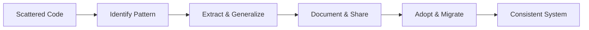

The **extract** skill identifies reusable patterns, components, and design tokens, then extracts and consolidates them into your design system for systematic reuse. This enriches your component library and promotes consistency.

## Purpose

Extract helps you:
- Identify repeated UI patterns worth systematizing
- Find hard-coded values that should become design tokens
- Consolidate inconsistent variations
- Create reusable components from scattered implementations
- Build and maintain a healthy design system

## Parameters

<ParamField path="target" type="string" optional>
  The feature, component, or area to extract from. When omitted, analyzes the entire codebase for extraction opportunities.
</ParamField>

## When to Use

Use the extract skill when:
- You notice repeated UI patterns across the codebase
- Hard-coded colors, spacing, or typography appear multiple times
- Similar components have inconsistent implementations
- You're establishing or enriching a design system
- Code duplication is creating maintenance burden
- Inconsistency is affecting user experience

## Workflow

### 1. Discover

#### Find the Design System

Locates your design system, component library, or shared UI directory. Understands:
- Component organization and naming conventions
- Design token structure (if any)
- Documentation patterns
- Import/export conventions

<Warning>
**If no design system exists**, the skill asks before creating one. It needs to understand your preferred location and structure first.
</Warning>

#### Identify Patterns

Searches for:
- **Repeated components**: Similar UI patterns used multiple times (buttons, cards, inputs)
- **Hard-coded values**: Colors, spacing, typography, shadows that should be tokens
- **Inconsistent variations**: Multiple implementations of the same concept
- **Reusable patterns**: Layout, composition, or interaction patterns worth systematizing

#### Assess Value

Not everything should be extracted. Considers:
- Is this used 3+ times, or likely to be reused?
- Would systematizing this improve consistency?
- Is this a general pattern or context-specific?
- What's the maintenance cost vs benefit?

### 2. Plan Extraction

Creates a systematic extraction plan:
- **Components to extract**: Which UI elements become reusable?
- **Tokens to create**: Which hard-coded values become design tokens?
- **Variants to support**: What variations does each component need?
- **Naming conventions**: Names that match existing patterns
- **Migration path**: How to refactor existing uses

<Info>
Design systems grow incrementally. Extract what's clearly reusable now, not everything that might someday be reusable.
</Info>

### 3. Extract & Enrich

Builds improved, reusable versions:

#### Components

Creates components with:
- Clear props API with sensible defaults
- Proper variants for different use cases
- Built-in accessibility (ARIA, keyboard navigation, focus management)
- Documentation and usage examples

**Example:**
```tsx
// Before: Scattered button implementations
<button className="bg-blue-500 text-white px-4 py-2 rounded">Save</button>
<button className="bg-blue-600 text-white px-3 py-2 rounded-md">Submit</button>

// After: Extracted Button component
<Button variant="primary">Save</Button>
<Button variant="primary">Submit</Button>
```

#### Design Tokens

Creates tokens with:
- Clear naming (primitive vs semantic)
- Proper hierarchy and organization
- Documentation of when to use each token

**Example:**
```css
/* Before: Hard-coded values */
color: #3b82f6;
padding: 16px;

/* After: Semantic tokens */
color: var(--color-primary);
padding: var(--spacing-4);
```

#### Patterns

Documents patterns with:
- When to use this pattern
- Code examples
- Variations and combinations

### 4. Migrate

Replaces existing uses with shared versions:
1. **Find all instances**: Search for the patterns you've extracted
2. **Replace systematically**: Update each use to consume the shared version
3. **Test thoroughly**: Ensure visual and functional parity
4. **Delete dead code**: Remove old implementations

### 5. Document

Updates design system documentation:
- Add new components to the component library
- Document token usage and values
- Add examples and guidelines
- Update Storybook or component catalog

## Key Principles

**Never:**
- Extract one-off, context-specific implementations without generalization
- Create components so generic they're useless
- Extract without considering existing conventions
- Skip proper TypeScript types or prop documentation
- Create tokens for every single value (tokens should have semantic meaning)

## Usage Examples

### Example 1: Extract Button Variants

```bash
/extract buttons
```

The skill will:
1. Find all button implementations across the codebase
2. Identify common patterns and variants
3. Create a unified Button component with proper variants
4. Replace all existing buttons with the new component
5. Document usage in the design system

### Example 2: Extract Color Tokens

```bash
/extract colors
```

The skill will:
1. Find all hard-coded color values
2. Group similar colors and identify semantic usage
3. Create color token system (primitive + semantic)
4. Replace hard-coded values with tokens
5. Document color usage guidelines

### Example 3: General Extraction

```bash
/extract
```

Without a target, the skill:
1. Analyzes entire codebase for duplication and patterns
2. Identifies highest-value extraction opportunities
3. Prioritizes by impact (frequency × inconsistency)
4. Systematically extracts and consolidates

## Design System Growth

The extract skill supports healthy design system evolution:



### Extraction Criteria

<Tabs>
  <Tab title="Extract">
    - Used 3+ times
    - Clear reuse potential
    - Improves consistency
    - Reduces maintenance
  </Tab>
  <Tab title="Don't Extract">
    - One-off implementations
    - Context-specific logic
    - Premature generalization
    - Low reuse likelihood
  </Tab>
</Tabs>

## Philosophy

A good design system is a living system. The extract skill helps you:
- Identify patterns as they emerge
- Enrich them thoughtfully
- Maintain them consistently

Design systems aren't built upfront—they're discovered, extracted, and refined over time.